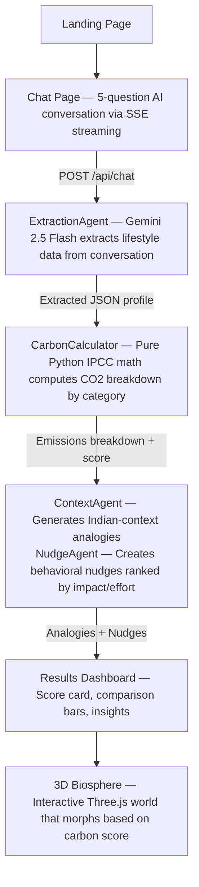

<div align="center">


# EcoMirror

AI-Powered Carbon Footprint Awareness Platform

Chat with AI → Get your carbon score → See your impact on a live 3D world

</div>

---

<div align="center">

[](https://nextjs.org/)
[](https://fastapi.tiangolo.com/)
[](https://threejs.org/)
[](https://ai.google.dev/)
[](https://python.org/)
[](https://tailwindcss.com/)

</div>

---

## Architecture



---

## Features

- **Conversational AI Audit** — 5-question natural language chat (no forms). SSE streaming for real-time responses.
- **Deterministic Carbon Calculator** — Pure Python IPCC-based math. Category breakdowns, 0–100 score, India/global benchmarks.
- **Interactive 3D Biosphere** — Procedural Three.js world that morphs based on your score. Trees, water, city, factory, wildlife — all react.
- **Actions & Analogy Dashboard** — Indian-context analogies + behavioral nudges ranked by impact/effort.
- **3D Screenshot Sharing** — Capture your biosphere, download PNG, copy to clipboard, share on LinkedIn with pre-filled post text.
- **User-Friendly Errors** — Centralized error mapping. No raw stack traces shown to users.
- **Robust Networking** — AbortController + timeouts on all API calls. SSE stream cancels on navigation.

---

## Quick Setup

### Prerequisites

- Node.js 18+
- Python 3.9+
- Google Gemini API key

### Backend

```bash
cd backend
python -m venv venv && source venv/bin/activate
pip install -r requirements.txt
cp .env.example .env  # Add your keys
uvicorn main:app --reload --port 8000
```

### Frontend

```bash
cd frontend
npm install --legacy-peer-deps
cp .env.example .env.local
npm run dev
```

Open [http://localhost:3000](http://localhost:3000)

---

## Environment Variables

| Variable | Where | Required | Description |
|----------|-------|----------|-------------|
| `GEMINI_API_KEY` | `backend/.env` | Yes | Google Gemini 2.5 Flash API key |
| `OPENAI_API_KEY` | `backend/.env` | No | Fallback LLM (GPT-4o-mini) |
| `CORS_ORIGINS` | `backend/.env` | No | Comma-separated allowed CORS origins |
| `NEXT_PUBLIC_BACKEND_URL` | `frontend/.env.local` | Yes | Backend URL (default: `http://localhost:8000`) |
| `NEXT_PUBLIC_APP_URL` | `frontend/.env.local` | No | Frontend URL for share links |

---

## Tests

```bash
# Backend — 70 tests, no API keys needed
cd backend && pytest tests/ -v

# Frontend — 18 tests
cd frontend && npm test
```

---

## Contributing

Contributions are welcome! Fork the repo, make your changes, and open a pull request.

---

<div align="center">

Built for Google Prompt Wars Virtual · Powered byGemini AI
</div>